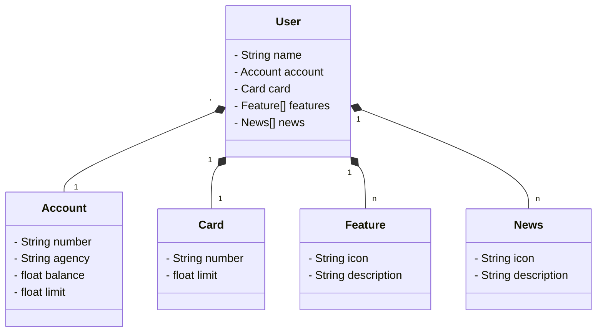

# DIO - Trilha Java Básico

## Autor

🔸[wprotheus](https://github.com/wprotheus)

---

### Publicando uma API REST na Nuvem Usando Java 21 LTS, Spring Boot 3.4.4 e Railway

Atividade executada, replicando os passos/codificação contidos nos vídeos, sendo assim uma cópia da implementação
apresentada, e conforme orientações abaixo, retiradas
do [Descrição do Desafio](https://web.dio.me/lab/publicando-sua-api-rest-na-nuvem-usando-spring-boot-3-java-17-e-railway/learning/ad7b622c-6ca0-4000-bf7b-2939591221ed)

<small>Obs.: O link acima somente é acessado através de uma conta na plataforma DIO.</small>  
<small>Obs.: Foram necessárias algumas alterações no código para que o aplicativo continuasse funcional, visto a data de disponibilidade do vídeo e a data de implementação (abr/2025).</small>

### Entendendo o Desafio
> **Agora é a sua hora de brilhar e construir um perfil de destaque na DIO! Explore todos os conceitos explorados até aqui e replique (ou melhore, porque não?) este projeto prático. Para isso, crie seu próprio repositório e aumente ainda mais seu portfólio de projetos no GitHub, o qual pode fazer toda diferença em suas entrevistas técnicas 😎**

> Já dominamos o universo do desenvolvimento e construímos uma API REST utilizando o Java 17, a versão LTS mais recente repleta de novidades. Com o poder do Spring Boot 3, otimizamos nossa produtividade graças à sua habilidade de autoconfiguração. Além disso, facilitamos o acesso aos bancos de dados SQL com o auxílio do Spring Data JPA. Também destacamos a importância de uma documentação de API robusta e clara, utilizando o OpenAPI, ou Swagger. E com o Railway, simplificamos o Deploy de nossas soluções na nuvem. Agora, é hora de embarcar em um novo desafio e explorar um domínio de aplicação diferente, mantendo nosso foco em inovar e desenvolver soluções de alto padrão!  
> 
<small>Obs.: , Java 21 LTS e Spring Boot 3.4.4</small>

### Descrição

> Vamos mergulhar diretamente no universo do desenvolvimento e construir uma API REST do zero! E o melhor de tudo,
> faremos isso utilizando o Java 17, a versão LTS mais recente que está recheada de novidades empolgantes. Para tornar a
> nossa jornada ainda mais produtiva, vamos empregar o poder do Spring Boot 3, que é amplamente conhecido por
> potencializar a produtividade dos desenvolvedores através de sua incrível capacidade de autoconfiguração. Mas não para
> por aí, vamos simplificar ainda mais o acesso aos bancos de dados SQL com o auxílio do Spring Data JPA. Durante nosso
> percurso, também vamos tratar da importância de uma documentação de API bem construída e fácil de compreender, para
> isso, vamos usar o OpenAPI, também conhecido como Swagger. Para finalizar nosso projeto, vamos usar o Railway, uma
> plataforma que torna o Deploy de soluções na nuvem muito mais simples. Assim, podemos nos concentrar no que realmente
> importa: o desenvolvimento das nossas soluções!
>
> Spring | REST | SQL | PostgreSQL | Railway  
<small>Obs.: , Java 21 LTS e Spring Boot 3.4.4</small>

## Diagrama de Classes

